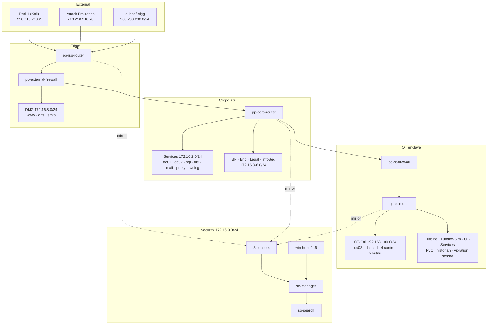

# Voltgrid Power — Range Guide

**A small electric utility, fully instrumented, under attack.**

`ss-pp-so` is a cyber range built around a fictional power company:
`voltgrid.com`. It has the things a real small utility has — an Active
Directory forest, departmental workstations, a public web presence, a mail
server — and the thing that makes it interesting: a genuine OT enclave running
gas-turbine plant equipment, separated from the corporate network by a firewall
boundary that an attacker has to cross.

Every packet that matters is mirrored into **Security Onion**, and every
Windows endpoint reports to it. Defenders get a real SIEM watching a real
network, and a red team — automated, manual, or both — that gives them
something to find.

**Who this is for:** range operators and instructors. It assumes you know
Security Onion. It covers what the range contains, what the sensors see, how to
stand it up, how to tell it is healthy, and what to expect once practitioners
are inside it.

---

## At a glance

| | |
|---|---|
| **Hosts** | 72 |
| **AD forest** | `voltgrid.com`, three domain controllers, 40 domain members |
| **Corporate segments** | Services, Business Processing, Engineering, Legal, InfoSec |
| **OT enclave** | Four segments behind a dedicated firewall — control, turbine, turbine-sim, OT services |
| **SIEM** | Security Onion 2.4 distributed — manager, search node, three sensors |
| **Network visibility** | Three GRE `gretap` mirrors covering corporate, OT and the attack path |
| **Endpoint visibility** | Elastic Agent on Windows and Linux hosts, enrolled into SO's Fleet |
| **Analyst positions** | Six dedicated hunt workstations on the security segment |
| **Attack sources** | Red-1 (Kali) for manual operations, SimSpace attack emulation for automated |
| **User activity** | 32 emulated users generating background traffic across the corporate segments |

---

## Why this range

Most SIEM training environments have one flaw: the network is a backdrop. Logs
arrive, analysts triage them, and nothing an attacker does is constrained by
topology.

This one is built the other way round. The OT enclave is genuinely segmented,
the DMZ is genuinely exposed, and the sensor placement means **what a defender
can see depends on where the attacker is**. An intrusion that stays in the DMZ
looks different from one that reaches the control network, because different
sensors carry it. That makes lateral movement legible rather than theoretical,
and it makes segmentation something practitioners reason about instead of
something they read about.

Add 32 emulated users producing real background noise, and detections have to
survive contact with a network that is already busy.

---

## Network architecture



### Segments

| Segment | CIDR | Contents |
|---|---|---|
| Services | 172.16.2.0/24 | `pp-dc01`, `pp-dc02`, `pp-sql`, `pp-file`, `pp-mail`, `pp-proxy`, `pp-syslog` |
| Business Processing | 172.16.3.0/24 | 8 workstations |
| Engineering | 172.16.4.0/24 | 8 workstations |
| Legal | 172.16.5.0/24 | 6 workstations |
| InfoSec | 172.16.6.0/24 | 4 workstations |
| DMZ | 172.16.8.0/24 | `pp-www`, `pp-dmz-dns`, `pp-dmz-smtp` |
| Security | 172.16.9.0/24 | SO grid, 6 hunt workstations |
| OT-Ctrl | 192.168.100.0/24 | `pp-dc03`, `pp-dcs-ctrl`, `pp-ctl-wks-01..04` |
| Gas-Turbine | 192.168.95.0/24 | Plant equipment |
| Gas-Turbine-Sim | 192.168.90.0/27 | Simulation |
| OT-Services | 192.168.90.96/27 | PLC, historian, vibration sensor, engineering workstation |
| Internet (sim) | 200.200.200.0/24 | `is-inet`, `elgg` |
| red-net | 210.210.210.0/24 | `Red-1`, Activity-Emulation |

Routing is OSPF area 0 across the corporate core with eBGP at the ISP edge.
The OT enclave sits behind `pp-ot-firewall` and reaches corporate over static
routes — an attacker crossing that boundary is making a routing decision a
sensor can see.

---

## Active Directory

`voltgrid.com`, single forest, three domain controllers:

| DC | Address | Placement |
|---|---|---|
| `pp-dc01` | 172.16.2.7 | Primary, Services segment |
| `pp-dc02` | 172.16.2.8 | Additional, Services segment |
| `pp-dc03` | 192.168.100.5 | Additional, **inside the OT enclave** |

`pp-dc03` is the interesting one. The OT control workstations authenticate
against a DC that lives on their side of the firewall, so OT identity traffic
does not routinely cross the boundary — which means when it *does*, that is a
signal.

40 hosts are domain members. Workstations run **emulated users** with real
identities (`charity.bowen`, `ahmed.ortega`, `david.miller` and 29 others) who
log in, browse, open documents and generate the background traffic that makes
detection non-trivial.

---

## The OT enclave

Four segments behind `pp-ot-firewall`, gatewayed by `pp-ot-router`:

- **OT-Ctrl** — `pp-dcs-ctrl` (the DCS control station) and four control
  workstations, plus `pp-dc03`.
- **Gas-Turbine**, **Gas-Turbine-Sim**, **OT-Services** — plant equipment:
  a PLC, a process historian, a vibration sensor, an engineering workstation.

The plant devices are **unmanaged** — they arrive pre-configured from their
images and Ansible does not touch them, exactly as real plant equipment behaves
under a corporate config-management regime.

`pp-dcs-ctrl`, the DCS control station, is fully instrumented here — Sysmon
and endpoint telemetry like any other Windows host. That is a deliberate range
choice: practitioners get complete visibility into an intrusion that reaches
process-control equipment, which is where the training value is.

It is worth knowing that this is *more* visibility than a conservative real-world
OT programme would allow. Many shops will not put a kernel-driver agent on
process-critical equipment and settle for log forwarding alone. If you want to
run an exercise under that constraint, removing `pp-dcs-ctrl` from Sysmon
coverage is a one-line inventory change and makes the OT enclave meaningfully
harder to investigate.

---

## Security Onion

Distributed 2.4 grid on the security segment:

| Node | Address | Role |
|---|---|---|
| `so-manager` | 172.16.9.30 | Manager, SOC web interface, Fleet |
| `so-search` | 172.16.9.35 | Search node |
| `so-sensor-corp` | 172.16.9.40 | Corporate traffic |
| `so-sensor-ot` | 172.16.9.41 | OT traffic |
| `so-sensor-edge` | 172.16.9.42 | Attack path and Internet |

### What each sensor sees

Traffic is mirrored from the routers into `gretap` tunnels — layer 2, so Zeek
receives real Ethernet frames and produces connection logs rather than silence.

| Sensor | Mirrors | Coverage |
|---|---|---|
| `so-sensor-corp` | `pp-corp-router` eth0–eth4 | Services, Business Processing, Engineering, Legal, InfoSec |
| `so-sensor-ot` | `pp-ot-router` eth1–eth4 | Gas-Turbine, Gas-Turbine-Sim, OT-Services, OT-Ctrl |
| `so-sensor-edge` | `pp-isp-router` eth1–eth2 | red-net and the simulated Internet |

**Management traffic is excluded.** On these routers the management IP shares a
data-plane interface, so the mirror carries `action pass` rules for
`10.255.240.0/20` ahead of the catch-all. Practitioners never see the
orchestration plane, which does not exist in-scenario.

This split is what makes the range teach segmentation. An attacker on red-net
is visible only to `so-sensor-edge`. Reaching the DMZ or corporate brings
`so-sensor-corp` into play. Crossing into the plant lights up `so-sensor-ot`.
Which sensor carries an event tells a defender where the adversary is.

### Endpoint telemetry

Elastic Agents on Windows and Linux endpoints enrol into SO's Fleet, so process
and file activity sits alongside network evidence. **Sysmon runs on all 45
Windows hosts** — every domain member, both DMZ servers, the OT control
station, and the six analyst workstations.

### Access

SOC web interface: **`https://172.16.9.30`**

Reach it from a hunt workstation. SOC is configured for IP access, so there is
no hostname to resolve.

---

## The analyst environment

Six Windows 10 workstations on the security segment — `win-hunt-1` through
`win-hunt-6`, `172.16.9.11–16` — with Chrome and autologin, positioned to reach
the SOC interface directly.

They are deliberately **not** running emulated users. Analyst boxes generating
synthetic browsing would inject noise into the exact host a hunter is
investigating from, and make their own tooling look adversary-shaped in their
own telemetry.

They do carry Sysmon and a log forwarder. An attacker who reaches an analyst
workstation sees everything the SOC sees and can steer the investigation, so
those hosts are monitored like any other endpoint.

---

## Generating attacks

Two sources, usable independently or together.

**Red-1** — a Kali desktop on red-net at `210.210.210.2`, for manual red team
work. Everything it does crosses `pp-isp-router` and is therefore carried by
`so-sensor-edge` on its way in.

**Attack emulation** — SimSpace's platform driving scripted activity against
the `[ae]` hosts: `pp-dc01`, `pp-dc02`, `pp-dc03`, `pp-file`, `pp-sql`,
`pp-mail`, `pp-dcs-ctrl`. Note the mix — two corporate DCs, the file and
database servers, mail, and the OT control station. The target set spans the
firewall boundary on purpose.

Both paths produce telemetry through the same sensors and the same Fleet
agents, so a scenario can begin automated and continue manually without the
defender's view changing shape.

---

## Standing the range up

```
cd /etc/ansible
wget -q -O ab_pp.tgz <tarball URL for the pinned commit>
tar -xzf ab_pp.tgz
sudo ./deploy.sh
```

`deploy.sh` makes three attempts: a full run, then failed hosts only, then a
full run again. Several steps depend on state another host reaches
asynchronously, so a first-attempt failure is often ordering rather than fault.

Expect **two to three hours** for a full build from a fresh blueprint. The
Security Onion manager install alone is 20–30 minutes and the search and sensor
installs 5–10 each.

### Verifying

```
sudo ./verify_so.sh -v          # Security Onion grid
sudo ./verify_deployment.sh     # range-wide
```

`verify_so.sh` prints its own totals. **The number that matters is Fail: 0.**

Then confirm the thing that most often fails silently — that sensors are
*seeing traffic*, not merely running:

```
sudo ansible so-sensor-corp,so-sensor-edge,so-sensor-ot -b -m shell \
  -a 'timeout 10 tcpdump -i tun0 -c 20 2>&1 | tail -3'
```

A sensor with Suricata alerting and Zeek producing zero connection logs means
the tunnel is carrying the wrong frame type. Both ends must be `gretap`.

---

## What healthy looks like

| Check | Expected |
|---|---|
| `so-status` on every SO node | all services running |
| Elastic cluster | green, search node present |
| `tcpdump -i tun0` on each sensor | packets flowing |
| Zeek `conn.log` | connection records, not zero |
| Fleet | every endpoint enrolled |
| Domain membership | 40 hosts joined to `voltgrid.com` |

---

## Known behaviours

Things that look like faults and are not.

**SOC health-check failures fetching detection content.** SOC tries to reach
GitHub every five minutes for rule updates, AI summaries and playbooks. The
range has no egress, so these fail continuously. Detection on ingested data is
unaffected.

**A `SA-cim_vladiator` export warning.** Cosmetic, and the app ships that way
deliberately.

**Emulated user noise.** 32 users producing browsing, file and process activity
is intentional. Detections that only work on a quiet network are not
detections.

**Gateway ARP repair messages during deploy.** `INIT_GW_REPAIRED_AND_PINNED` in
the run output is the platform-level ARP fault being caught and corrected
before it can break routing. Seeing it is good; it means the guard is working.

---

## Credentials

> Passwords live in `group_vars/all/vault.yml`. Retrieve them on the controller
> with `./vault-tools.sh view`, or `sudo ansible-vault view
> group_vars/all/vault.yml`.

| System | Username | Password |
|---|---|---|
| Security Onion SOC | `admin@voltgrid.com` | `vault_so_web_password` |
| Domain admin | `simspace` | `vault_domain_admin_password` |
| Windows servers | `simspace` | `vault_windows_password` |
| Windows 10/11 workstations | `xadmin` | `vault_win_workstation_password` |
| Linux hosts | `simspace` | `vault_linux_password` |
| pfSense firewalls | `admin` | `vault_pfsense_password` |
| VyOS routers | `vyos` | `vault_vyos_password` |

Workstation and server credentials differ — the workstation images ship a
different local account. Using the wrong one does not fail fast; it retries
until timeout and looks like an unbooted host.

---

## Appendix — full host inventory

| Host | Address | Segment | Function |
|---|---|---|---|
| `Activity-Emulation` | 210.210.210.70 | red-net | workstation / member |
| `Red-1` | 210.210.210.2 | red-net | workstation / member |
| `ansible` | 10.10.10.10 | — | ansible_controller |
| `elgg` | 200.200.200.205 | Internet (sim) | unmanaged |
| `is-inet` | 200.200.200.2 | Internet (sim) | email |
| `pp-bp-wkstn-1` | 172.16.3.10 | Business Processing | workstation |
| `pp-bp-wkstn-2` | 172.16.3.3 | Business Processing | workstation |
| `pp-bp-wkstn-3` | 172.16.3.4 | Business Processing | workstation |
| `pp-bp-wkstn-4` | 172.16.3.5 | Business Processing | workstation |
| `pp-bp-wkstn-5` | 172.16.3.6 | Business Processing | workstation |
| `pp-bp-wkstn-6` | 172.16.3.7 | Business Processing | workstation |
| `pp-bp-wkstn-7` | 172.16.3.8 | Business Processing | workstation |
| `pp-bp-wkstn-8` | 172.16.3.9 | Business Processing | workstation |
| `pp-corp-router` | 172.16.2.1 | Services | vyos |
| `pp-ctl-wks-01` | 192.168.100.101 | OT-Ctrl | ot_control |
| `pp-ctl-wks-02` | 192.168.100.102 | OT-Ctrl | ot_control |
| `pp-ctl-wks-03` | 192.168.100.103 | OT-Ctrl | ot_control |
| `pp-ctl-wks-04` | 192.168.100.104 | OT-Ctrl | ot_control |
| `pp-dc01` | 172.16.2.7 | Services | pdc |
| `pp-dc02` | 172.16.2.8 | Services | additional_dc |
| `pp-dc03` | 192.168.100.5 | OT-Ctrl | additional_dc |
| `pp-dcs-ctrl` | 192.168.100.10 | OT-Ctrl | ot_servers |
| `pp-dmz-dns` | 172.16.8.4 | DMZ | dmz |
| `pp-dmz-smtp` | 172.16.8.3 | DMZ | dmz |
| `pp-eng-wkstn-1` | 172.16.4.10 | Engineering | workstation |
| `pp-eng-wkstn-2` | 172.16.4.3 | Engineering | workstation |
| `pp-eng-wkstn-3` | 172.16.4.4 | Engineering | workstation |
| `pp-eng-wkstn-4` | 172.16.4.5 | Engineering | workstation |
| `pp-eng-wkstn-5` | 172.16.4.6 | Engineering | workstation |
| `pp-eng-wkstn-6` | 172.16.4.7 | Engineering | workstation |
| `pp-eng-wkstn-7` | 172.16.4.8 | Engineering | workstation |
| `pp-eng-wkstn-8` | 172.16.4.9 | Engineering | workstation |
| `pp-engws` | — | — | unmanaged |
| `pp-external-firewall` | 10.255.240.191 | — | pfsense |
| `pp-file` | 172.16.2.3 | Services | file |
| `pp-gas-sim` | — | — | unmanaged |
| `pp-gasplant-plc` | — | — | unmanaged |
| `pp-gasvibsens` | — | — | unmanaged |
| `pp-internal-firewall` | 10.255.240.197 | — | pfsense |
| `pp-internal-router` | 172.16.9.1 | Security | vyos |
| `pp-is-wkstn-1` | 172.16.6.10 | InfoSec | workstation |
| `pp-is-wkstn-2` | 172.16.6.3 | InfoSec | workstation |
| `pp-is-wkstn-3` | 172.16.6.4 | InfoSec | workstation |
| `pp-is-wkstn-4` | 172.16.6.5 | InfoSec | workstation |
| `pp-isp-router` | 75.21.1.2 | ISP | vyos |
| `pp-ls-wkstn-1` | 172.16.5.10 | Legal | workstation |
| `pp-ls-wkstn-2` | 172.16.5.3 | Legal | workstation |
| `pp-ls-wkstn-3` | 172.16.5.4 | Legal | workstation |
| `pp-ls-wkstn-4` | 172.16.5.5 | Legal | workstation |
| `pp-ls-wkstn-5` | 172.16.5.6 | Legal | workstation |
| `pp-ls-wkstn-6` | 172.16.5.7 | Legal | workstation |
| `pp-mail` | 172.16.2.5 | Services | workstation / member |
| `pp-ot-firewall` | 10.255.240.190 | — | pfsense |
| `pp-ot-hist` | — | — | unmanaged |
| `pp-ot-router` | 192.168.200.202 | — | vyos_routes_only |
| `pp-proxy` | 172.16.2.20 | Services | proxy |
| `pp-splunk` | 172.16.9.20 | Security | workstation / member |
| `pp-sql` | 172.16.2.4 | Services | workstation / member |
| `pp-syslog` | 172.16.2.9 | Services | syslog |
| `pp-www` | 172.16.8.5 | DMZ | wordpress-pv |
| `site-edge-router` | 172.16.0.17 | transit | vyos |
| `so-manager` | 172.16.9.30 | Security | so_manager |
| `so-search` | 172.16.9.35 | Security | so_search |
| `so-sensor-corp` | 172.16.9.40 | Security | so_sensor |
| `so-sensor-edge` | 172.16.9.42 | Security | so_sensor |
| `so-sensor-ot` | 172.16.9.41 | Security | so_sensor |
| `win-hunt-1` | 172.16.9.11 | Security | hunt |
| `win-hunt-2` | 172.16.9.12 | Security | hunt |
| `win-hunt-3` | 172.16.9.13 | Security | hunt |
| `win-hunt-4` | 172.16.9.14 | Security | hunt |
| `win-hunt-5` | 172.16.9.15 | Security | hunt |
| `win-hunt-6` | 172.16.9.16 | Security | hunt |
